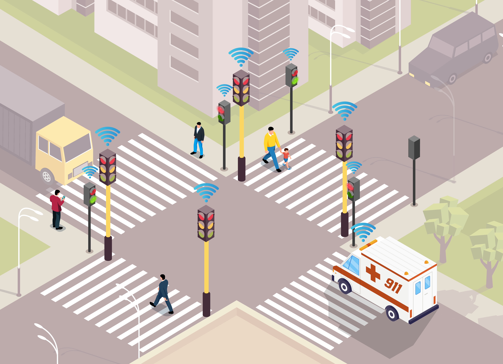

# AllWays Safe - Intelligent Traffic Management System

*An intelligent V2I/I2P traffic control system for enhanced road safety and accessibility*

---

## Overview

**AllWays Safe** is an intelligent traffic management system designed to improve road safety, reduce congestion, and enhance accessibility for all road users. The system implements **Vehicle-to-Infrastructure (V2I)** and **Infrastructure-to-Pedestrian (I2P)** communication technologies to enable real-time traffic adaptation.

### Problem Statement

Traditional traffic systems lack real-time adaptability and effective communication between road users and infrastructure. AllWays Safe addresses this by:

- Prioritizing emergency vehicles (ambulances, fire trucks) to reduce response times
- Extending crossing times for pedestrians with reduced mobility via RFID detection
- Dynamically adjusting traffic signals based on pedestrian demand
- Providing real-time monitoring through a cloud-based interface

### Project Context

Developed as part of the **Master's in Industrial Electronics and Computers**, in the **Embedded Systems and Computers specialization** at the **University of Minho**.

**Authors:** André Martins (PG60192), Mariana Martins (PG60211)  
**Supervisor:** Professor Adriano Tavares  
**Date:** January 2026

---

## Key Features

### 🚦 Intelligent Traffic Control
- **Adaptive Signal Timing:** Dynamic configuration based on traffic flow and pedestrian demand
- **Conflict-Free Scheduling:** Graph-theory-based algorithm ensures safe semaphore configurations
- **Emergency Priority:** Automatic green-wave for emergency vehicles via DDS communication

### ♿ Enhanced Accessibility
- **RFID Card Detection:** Extends crossing time for registered users with disabilities
- **Button-Based Requests:** Early pedestrian crossing based on demand threshold
- **Audio Feedback:** Buzzer alerts for safe crossing and emergency situations

### 🚑 Emergency Vehicle Integration
- **Fast DDS Communication:** Real-time message publishing to nearby intersections
- **Automatic Network Discovery:** Connects to intersection access points dynamically
- **Battery Monitoring:** Continuous voltage monitoring with visual low-battery warnings

### ☁️ Cloud Integration
- **RESTful API:** Centralized data management via Supabase PostgreSQL database
- **Real-Time Monitoring:** Web-based GUI with live semaphore status updates
- **Configuration Management:** Remote setup of control boxes, semaphores, and users

---

## Software Stack

### Embedded System (Buildroot)
- **OS:** Custom Linux image (Buildroot)
- **Language:** C++ (OOP with SOLID principles)
- **Threading:** POSIX Threads (custom RAII wrappers)
- **Communication:**
  - **Fast DDS:** Real-time pub/sub messaging
  - **libcurl + curlpp:** HTTP/HTTPS communication
  - **json-modern-cpp:** JSON parsing
- **Device Drivers:**
  - **Custom PWM driver:** Buzzer and LED control
  - **SPI kernel driver:** RFID communication
  - **I2C kernel driver:** ADC integration
- **GPIO Control:** libgpiod

### Cloud Backend
- **Database:** Supabase (PostgreSQL)
- **API:** Node.js + Express (RESTful)
- **Real-Time:** Supabase Realtime channels

### Frontend
- **Framework:** React + Vite
- **Styling:** Tailwind CSS
- **Icons:** Lucide React

---

## License

This project was developed as part of an academic program at the University of Minho. Please contact the authors for usage permissions.

---

## Authors

- **André Martins** - PG60192
- **Mariana Martins** - PG60211 (https://github.com/Mariana2724)

**Supervisor:** Professor Adriano Tavares

---

**Built with ❤️ for safer, more accessible roads**

